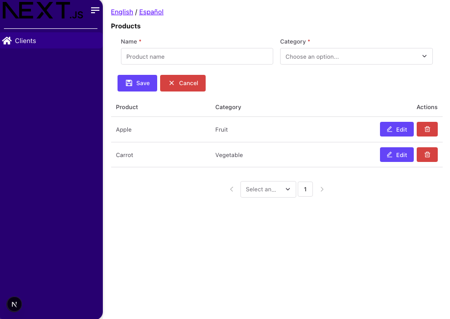

# **Next.js mm-front-components Boilerplate**

Este proyecto es un **boilerplate base para integrar la librería [mm-front-components](https://www.npmjs.com/package/mm-front-components)** en aplicaciones Next.js.

Incluye una configuración completa y un **demo funcional de los componentes** listos para usarse y personalizarse según las necesidades del proyecto.

Si prefieres empezar más rápido, puedes clonar directamente este repositorio:  
👉 [https://github.com/joseiguti/mm-front-boilerplate](https://github.com/joseiguti/mm-front-boilerplate)

---

## Capturas de pantalla

Aquí puedes ver cómo luce el proyecto al ejecutarlo por primera vez:

**1. Incluye la mayoria de componentes trabajando**  

---

## **Framework principal**

- **Next.js (15.0.3)**:
  - Soporte para SSR, SSG, ISR y rutas dinámicas.
- **React (18.3.1)** y **React DOM (18.3.1)**.

---

## **Estilización**

- **styled-components (6.1.13)**:
  - CSS-in-JS con soporte para SSR.
- **babel-plugin-styled-components (2.1.4)**:
  - Optimización para SSR.

---

## **Internacionalización (i18n)**

- **i18next (24.0.2)**:
  - Manejo de múltiples idiomas.
- **react-i18next (15.1.2)**:
  - Integración con React.
- **i18next-browser-languagedetector (8.0.0)**:
  - Detecta idioma del navegador.
- **i18next-http-backend (3.0.1)**:
  - Carga traducciones desde archivos JSON.

---

## **Gestión de formularios**

- **react-hook-form (7.53.2)**:
  - Manejo eficiente y ligero de formularios.

---

## **Tipado estático**

- **TypeScript (5.x)**:
  - Mejora la robustez del código.
- **@types/node (20)**, **@types/react (18)**, **@types/react-dom (18)**.

---

## **Control de calidad del código**

- **ESLint (9.15.0)**:
  - Configuración personalizada con reglas estrictas.
- **Configuración de plugins**:
  - `react`: Buenas prácticas para React.
  - `jsx-a11y`: Accesibilidad mejorada.
  - `import`: Gestión organizada de importaciones.
- **Reglas estrictas agregadas**:
  - Ordenación de importaciones con `import/order`.
  - Prohibición de `var` y preferencia por funciones flecha.
  - Validación de props y uso de `jsx-a11y` para accesibilidad.

---

## **Formatos**

- **Prettier (3.4.1)**:
  - Formateo consistente del código.
  - Integrado con ESLint para evitar conflictos.

---

## **Scripts disponibles**

- **dev**: Inicia el servidor de desarrollo.
- **build**: Construye la aplicación optimizada para producción.
- **start**: Sirve la aplicación en producción.
- **lint**: Valida el código con ESLint.
- **format**: Formatea el código con Prettier.
- **format:check**: Verifica el formato sin modificar archivos.
- **clean**: Limpia el directorio de construcción.
- **demo**: Inicia el servidor de desarrollo en el puerto 4000.

---

## **Aclaración**

Aunque no se utiliza `eslint-config-airbnb` directamente, se han integrado las reglas esenciales de Airbnb a través de configuraciones personalizadas en ESLint. Esto garantiza que las mejores prácticas de Airbnb estén presentes sin conflictos con otras herramientas como Next.js o Prettier.
